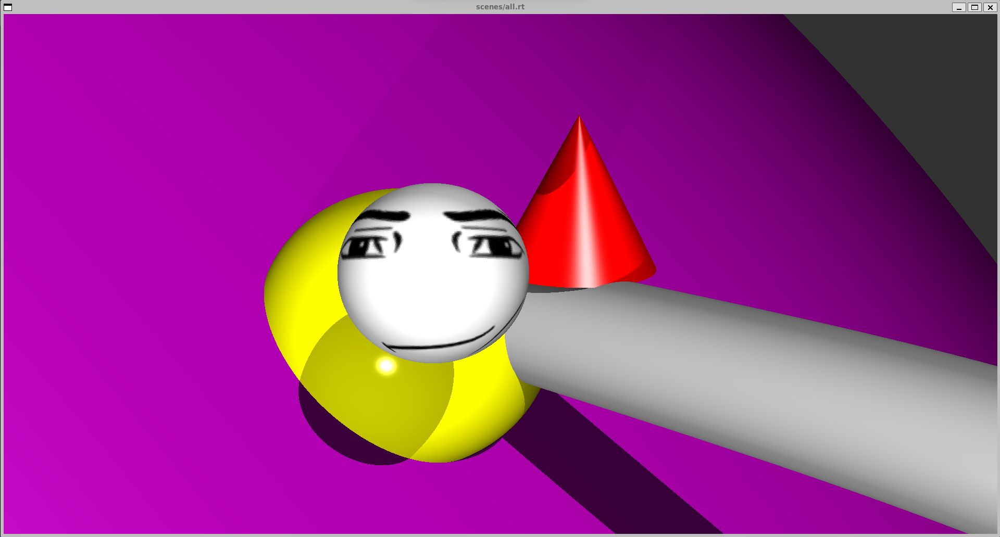

# 42KL-MiniRT
A basic raytracing engine.

## Features

- CPU based rendering
- Objects (Plane, Sphere, Cylinder, Cone)
- Colored & multiple spot lighting
- Full Phong Reflection Model (Diffuse, Specular, Ambient)
- Texture support (for spheres)

## Dependencies

- gcc w/ Math Library
- MinilibX Library
- GNU Make

## Installation

1. clone this repo ```git clone https://github.com/LaiAnTan/42KL-MiniRT```
2. Install the correct version of MinilibX
	- linux: ```git clone https://github.com/42Paris/minilibx-linux``` and put it in the same directory as this repo
	- mac: unzip the .tgz archive file [here](/dependency/minilibx_opengl.tgz)
3. ```make``` to compile
4. ```./minirt <.rt file>``` to run (sample scenes [here](/scenes/))

## Contributors

- cshi-xia ([@SphagettiCodes](https://github.com/SpaghettiCodes))
- tlai-an ([Myself](https://github.com/LaiAnTan))

## Documentation && Resources

soon

## Gallery

Different material colours & specular reflection depicting roughness of spheres


Multi spot & coloured lighting, hard shadows


All objects & sphere texturing
